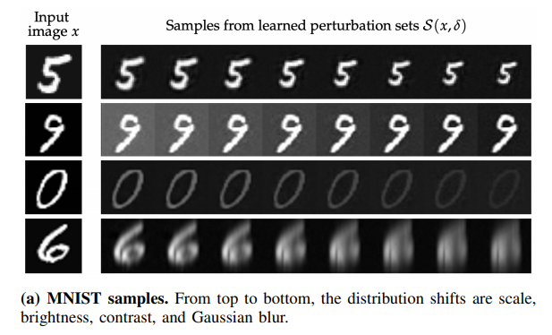

# Benchmarks for VNN-Comp 2023

## Description

The benchmark set comes from the paper ["Toward Certified Robustness Against Real-World
Distribution Shifts"](https://arxiv.org/pdf/2206.03669.pdf), which deals with 
checking the robustness of a perception network  w.r.t. perturbations beyond 
handcrafted perturbations (e.g., l_p norm bounded). 
Concretely, a generative model is trained to take in an unperturbed image and an embedding 
of a particular type of distribution shifts in latent space, and produce a perturbed image.
The verification checks that a classifier correctly classifies all images in a perturbation set,
which is a set of images generated by the generative model given a fixed image and a
ball centering the mean perturbations on this image (in the latent space). 
This mean perturbation is computed by a prior network.

This benchmark set involves checking the robustness of a MNIST classifier w.r.t. the
"shear" perturbation. To fit the competition format, we concatenated the generative model and 
the classifier into a single network ``onnx/mnist_concat.onnx``. 

## Generating the bnechmarks

``python3 generate_properties.py [seed]``

This will randomly pick 72 correctly classified MNIST test images and 
generate 72 `.vnnlib` files in the ``vnnlib`` folder. It also creates a csv file where each line
is of the form:

``[network],[property],[timeout]``

A timeout of 5 minutes is given for each query.